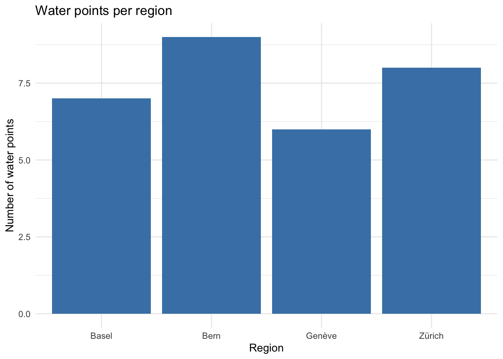

<!-- README.md is generated from README.Rmd. Please edit that file -->

# pkgreviewtest

<!-- badges: start -->

<!-- badges: end -->

The pkgreviewtest package provides water point observations from four
Swiss regions. Each observation records the water source type, the
functional status of the water point, the installation date, and the
number of people using it. The data support exploratory analyses of
water point functionality and coverage. This package is a fixture used
to test the openwashdata package review workflow.

## Installation

You can install the development version of pkgreviewtest from GitHub
with:

``` r
# install.packages("devtools")
devtools::install_github("openwashdata/pkgreviewtest")
```

## Data

The package provides access to one dataset, `pkgreviewtest`.

``` r
library(pkgreviewtest)
```

### pkgreviewtest

The dataset `pkgreviewtest` has 30 observations and 7 variables.

``` r
pkgreviewtest |>
  head(3)
#>       id region      waterSource         status installation_date users_count
#> 1 WP-001 Genève        rainwater     functional        2018-03-11         377
#> 2 WP-002   Bern protected spring Non-Functional        2020-09-06          70
#> 3 WP-003  Basel    hand-dug well     functional        30/10/2021         269
#>        owner_phone
#> 1 +41 79 137 11 23
#> 2 +41 79 174 22 46
#> 3 +41 79 211 33 69
```

For an overview of the variable names, see the following table.

<div style="border: 1px solid #ddd; padding: 0px; overflow-y: scroll; height:200px; ">

<table class="table table-striped" style="margin-left: auto; margin-right: auto;">

<thead>

<tr>

<th style="text-align:left;position: sticky; top:0; background-color: #FFFFFF;">

variable_name
</th>

<th style="text-align:left;position: sticky; top:0; background-color: #FFFFFF;">

variable_type
</th>

<th style="text-align:left;position: sticky; top:0; background-color: #FFFFFF;">

description
</th>

</tr>

</thead>

<tbody>

<tr>

<td style="text-align:left;">

id
</td>

<td style="text-align:left;">

character
</td>

<td style="text-align:left;">

Water point identifier
</td>

</tr>

<tr>

<td style="text-align:left;">

region
</td>

<td style="text-align:left;">

character
</td>

<td style="text-align:left;">

Region where the water point is located
</td>

</tr>

<tr>

<td style="text-align:left;">

waterSource
</td>

<td style="text-align:left;">

character
</td>

<td style="text-align:left;">

Type of water source
</td>

</tr>

<tr>

<td style="text-align:left;">

status
</td>

<td style="text-align:left;">

character
</td>

<td style="text-align:left;">

NA
</td>

</tr>

<tr>

<td style="text-align:left;">

installation_date
</td>

<td style="text-align:left;">

character
</td>

<td style="text-align:left;">

Date the water point was installed
</td>

</tr>

<tr>

<td style="text-align:left;">

users_count
</td>

<td style="text-align:left;">

integer
</td>

<td style="text-align:left;">

TODO
</td>

</tr>

<tr>

<td style="text-align:left;">

owner_phone
</td>

<td style="text-align:left;">

character
</td>

<td style="text-align:left;">

Phone number of the water point owner
</td>

</tr>

</tbody>

</table>

</div>

## Example

``` r
library(ggplot2)

ggplot(pkgreviewtest, aes(x = region)) +
  geom_bar(fill = "steelblue") +
  labs(
    title = "Water points per region",
    x = "Region",
    y = "Number of water points"
  ) +
  theme_minimal()
```



The bar chart in figure `fig-users` shows the number of observed water
points in each of the four regions.

## License

Data are available as [MIT](https://opensource.org/license/mit).

## Citation

Please cite this package using:

``` r
citation("pkgreviewtest")
#> To cite package 'pkgreviewtest' in publications use:
#> 
#>   Lastname F (2026). "pkgreviewtest: Water Point Observations for
#>   Review Workflow Testing."
#>   <https://github.com/openwashdata/pkgreviewtest>.
#> 
#> A BibTeX entry for LaTeX users is
#> 
#>   @Misc{,
#>     title = {pkgreviewtest: Water Point Observations for Review Workflow Testing},
#>     author = {Firstname Lastname},
#>     year = {2026},
#>     url = {https://github.com/openwashdata/pkgreviewtest},
#>     abstract = {Water point observations from four Swiss regions, including water source type, functional status, installation date, and number of users.},
#>   }
```
